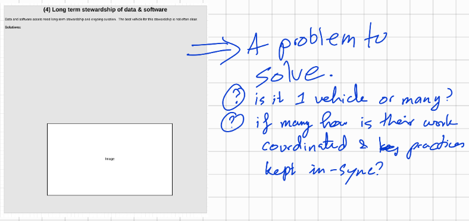

# (004) Long term stewardship of data and software

## Context

Data and software assets need long-term stewardship and ongoing curation.  

## Problem

The best vehicle for this stewardship is not often clear.

## Solution patterns

## Related Patterns

## Examples

<links to examples>