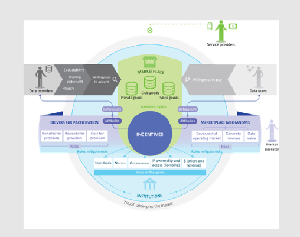

# (005) Data market

## Context
Data is a tradable item.  There are competing forces that provide incentives and disincentives for sharing and trading data.
`<describe this better>`

## Problem

## Solution patterns
Paul Box's data market model. ``

## Related Patterns

## Examples

`<links to examples>`