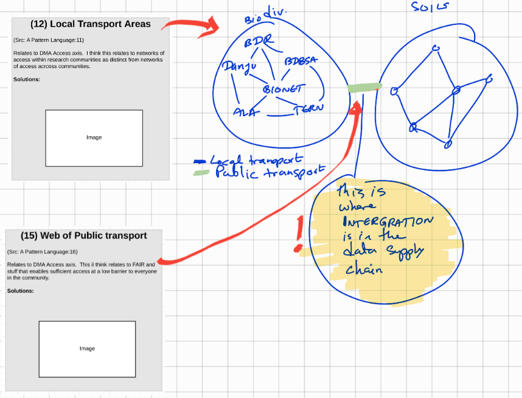

# (012) Local Transport Areas

## Context

## Problem

## Consequence of problem

## Solution patterns

## Related Patterns

* [(041) Dunbar's number](041%20-%20Dunbar's%20number.md)  

## Examples

<links to examples>