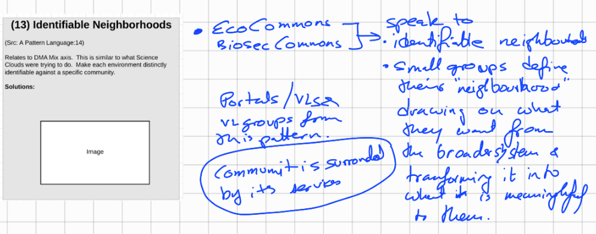

# (013) Identifiable Neighbourhoods

## Context

## Problem

## Consequence of problem

## Solution patterns

## Related Patterns

* [(018) Main Gateways](https://github.com/kheerand/Social-architecture-pattern-library/blob/master/patterns/(018)%20Main%20gateways/README.md)  
* [(041) Dunbar's number](../(041)%20Dunbar%20number/README.md)  

## Examples

<links to examples>
