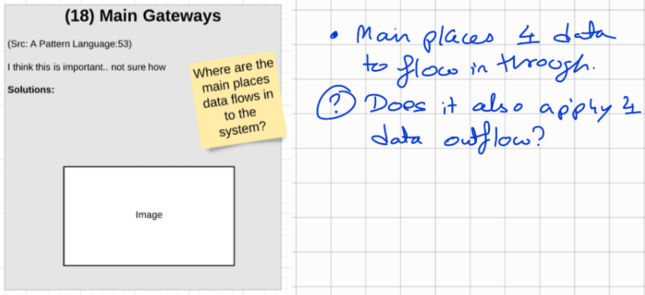

# (018) Main Gateways

## Context

> **NOTE**: I've covered the data outflow but still need to cover off data inflow

## Problem

As data infrastructures become interconnected and distributed, and have bigger and increasingly sophisticated data, there are many entryways 
to access the data that reach part of the data, but not the whole.

## Consequence of problem

This leads to confusion for the consumer as to where to start.

## Solution patterns

Establish a set of main gateways for access to the data.  These gateways should lead the data consumer to be able to access the data that is
relevant to them.  Each gateway should have a distinct focus, or specific context through which it presents the data to both deferentiate it
from other main gateways and to provide additional context to the consumer.

## Related Patterns
* [(030) Connected systems](https://github.com/kheerand/Social-architecture-pattern-library/blob/master/patterns/(030)%20Connected%20Systems/README.md)
* [(013) Identifiable Neighbourhoods](https://github.com/kheerand/Social-architecture-pattern-library/blob/master/patterns/(013)%20Identifiable%20neighbourhoods/README.md)

## Examples

> NOTE: Confirm that these are correct

- GBIF - and related atlases for biodiversity data

<links to examples>
