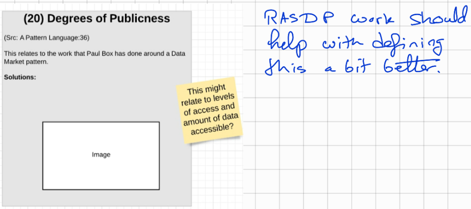

# (020) Degrees of Publicness

**`STATUS:`** `Early thoughts on pattern`

## Context

Data has value.  There is value to the individual, there is value to others, and there is value to the public.

## Problem

There is competing tentions to maximise the value of the data for different stakeholders.

## Consequence of problem

Thinking of this often leads to conisdering data as either being privately held or public.
Depending on the concerns, this could lead to data either being kept too restrictevly or shared too broadly to the public (often with redacted content, resulting in lower value of the data).

## Solution patterns

The openness of data does not need to be a binary state.  There can be different degrees of publicness.  Individual, work group, organisation, other trusted groups (data club), public are some groupings that could be conisdered.

## Related Patterns

## Examples

* [RASD framework](examples/E020.1-RASD_Framework.md)

<links to examples>