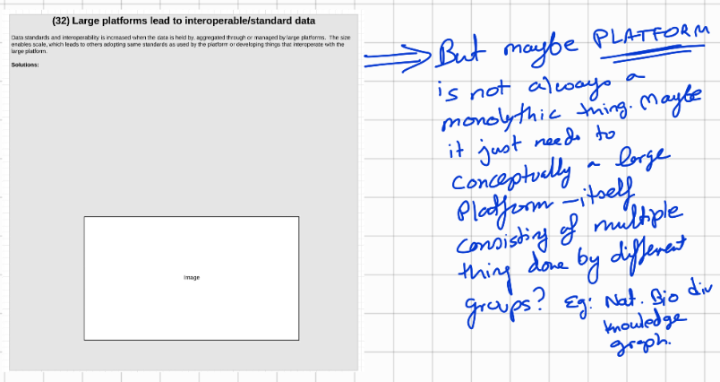

# (032) Large platforms lead to interoperable data

## Context

Data standards and interoperability is increased when the data is held by, aggregated through or managed by large platforms.  The size enables scale, which leads to others adopting same standards as used by the platform or developing things that interoperate with the large platform.

> **NOTE**:
> This is more of a solution pattern.  Need to convert it into a problem-solution pattern
>
>This is related to [(011)_Magic_of_the_city](../(011)_Magic_of_the_city/(011)_Magic_of_the_city.md)

## Problem

## Consequence of problem

## Solution patterns

## Related Patterns

* [(011)_Magic_of_the_city](../(011)_Magic_of_the_city/(011)_Magic_of_the_city.md)

## Examples

<links to examples>